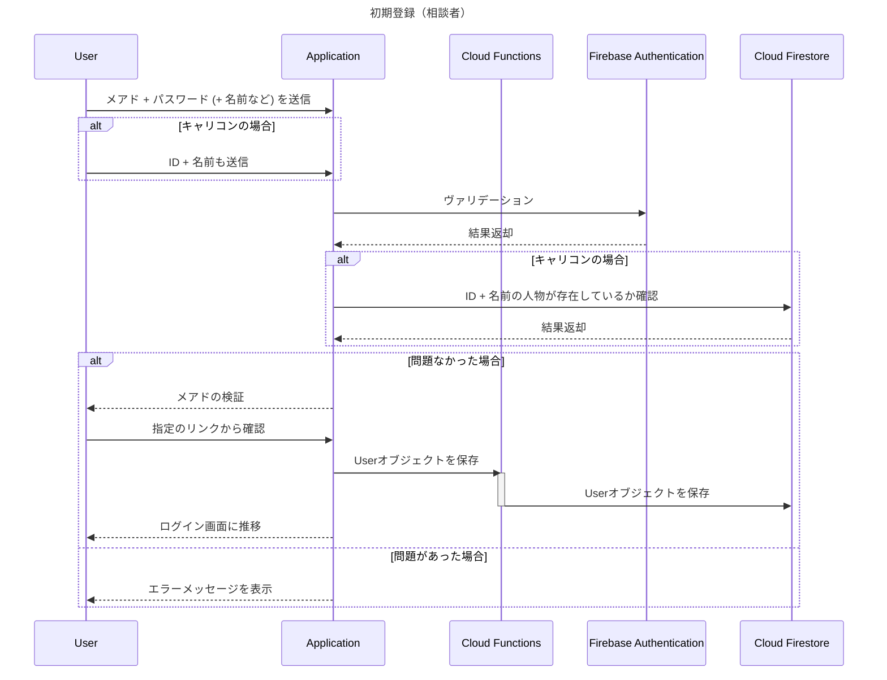

## 使用技術一覧



## 目次
1. [プロジェクトについて](#プロジェクトについて)
2. [環境](#環境)
3. [ディレクトリ構成](#ディレクトリ構成)
4. [設定方法（フロントエンド）](#設定方法フロントエンド)
4. [設定方法（バックエンド）](#設定方法バックエンド)

## プロジェクトについて
Firebase Authentication & JWT での認証システム


## 環境
|言語・フレームワーク |	バージョン |
| ------------------- | ----------- |
| Node.js | 16, 18, 20 (推奨バージョン) |
| Vue.js | 3.4.18 |
| Quasar | 2.8.0 |
| Axios	| 1.6.8 |
| Firebase | 10.9.0 |
| Vue Router | 4.0.12 |
| TypeScript | 4.5.4 |
| Express | 4.19.2 |
| Firebase Admin | 12.0.0 |
| CORS | 2.8.5 |
| dotenv | 16.4.5 |

## ディレクトリ構成
### フロントエンド
```bash
    frontend                             
    │   
    ├─ src                               
    │   ├─ assets                         
    │   │   ├─ google.png                 
    │   │   └─ quasar-logo-vertical.svg   
    │   │   
    │   ├─ boot                           
    │   │   ├─ axios.ts                   
    │   │   └─ firebase.ts                
    │   │   
    │   ├─ components                     
    │   │   ├─ EssentialLink.vue          
    │   │   └─ models.ts                  
    │   │   
    │   ├─ css                            
    │   │   ├─ app.scss                   
    │   │   └─ quasar.variables.scss      
    │   │   
    │   ├─ layouts                        
    │   │   ├─ FirstLayout.vue            
    │   │   └─ MainLayout.vue             
    │   │   
    │   ├─ pages                          
    │   │   ├─ ErrorNotFound.vue          
    │   │   ├─ IndexPage.vue              
    │   │   ├─ LoginPage.vue              
    │   │   ├─ MainPage.vue               
    │   │   └─ RegisterPage.vue           
    │   │   
    │   ├─ router                         
    │   │   ├─ index.ts                   
    │   │   └─ routes.ts                  
    │   │   
    │   ├─ App.vue                        
    │   ├─ env.d.ts                       
    │   ├─ quasar.d.ts                    
    │   └─ shims-vue.d.ts                 
    │   
    ├─ .editorconfig                      
    ├─ .eslintignore                      
    ├─ .eslintrc.cjs                      
    ├─ .gitignore                         
    ├─ .npmrc                             
    ├─ .prettierrc                        
    ├─ index.html                         
    ├─ package-lock.json                  
    ├─ package.json                       
    ├─ postcss.config.cjs   
    ├─ quasar.config.js               
    ├─ tsconfig.json   
    └─ tsconfig.vue-tsc.json              
```

### バックエンド
```bash
    backend                         
    ├─ src                          
    │   ├─ config                   
    │   │   └─ firebase.ts          
    │   │   
    │   ├─ middlewares              
    │   │   └─ authMiddleware.ts    
    │   │   
    │   ├─ routes                   
    │   │   └─ protectedRoutes.ts   
    │   │   
    │   ├─ types                    
    │   │   └─ express.d.ts         
    │   │   
    │   └─ server.ts                
    │   
    ├─ .gitignore                   
    ├─ nodemon.json                 
    ├─ package-lock.json            
    ├─ package.json                 
    ├─ service-account-file.json    
    └─ tsconfig.json                
```


## 設定方法（フロントエンド）
### Firebase Authentication の設定

**ステップ 1: Firebaseプロジェクトの作成**
1. [Firebase Console](https://console.firebase.google.com/)にアクセス
2. 「プロジェクトを追加」をクリックして、新しいFirebaseプロジェクトを作成
3. プロジェクト名を入力し、必要な設定を完了させる

**ステップ 2: 認証方法の設定**
1. Firebase Consoleで、作成したプロジェクトを選択します。
2. 「Authentication」を選択し、「Sign-in method」タブに進む
3. 「メール/パスワード」と「Google」の認証プロバイダを有効にする

**ステップ 3: Firebaseアプリの設定**
1. プロジェクトの設定ページに進み、「マイアプリ」セクションで、ウェブアプリ（`</>`アイコン）を追加
2. アプリのニックネームを設定し、Firebase SDKの設定スニペットを取得

**ステップ 4: Firebase設定ファイルの作成**
1. frontend/src/bootディレクトリに `firebase.ts` ファイルを作成
2. Firebase SDKの設定スニペットを貼り付ける
3. 各フィールドの値は、ステップ 3で取得したものを使用する

```typescript
import { initializeApp } from 'firebase/app';
import { getAuth } from 'firebase/auth';

const firebaseConfig = {
    apiKey: "YOUR_API_KEY",
    authDomain: "YOUR_AUTH_DOMAIN",
    projectId: "YOUR_PROJECT_ID",
    storageBucket: "YOUR_STORAGE_BUCKET",
    messagingSenderId: "YOUR_MESSAGING_SENDER_ID",
    appId: "YOUR_APP_ID"
};

const app = initializeApp(firebaseConfig);
const auth = getAuth(app);

export { app, auth };
```
### 依存関係のインストール
```bash
npm install
```

### アプリケーションの起動
```bash
npm run dev
```

## 設定方法（バックエンド）
### Firebase Admin SDK のセットアップ

**ステップ 1: Firebaseプロジェクトでサービスアカウントキーを生成**
1. [Firebase Console](https://console.firebase.google.com/)にアクセスし、プロジェクトを選択
2. 「プロジェクトの設定」に進み、「サービスアカウント」タブを選択
3. 「新しい秘密鍵の生成」ボタンをクリックし、表示されるダイアログで「キーを生成」を選択
4. ダウンロードされたJSONファイルを、プロジェクトの `src/backend` ディレクトリに `service-account-file.json` として保存

**ステップ 2: Firebase設定ファイルの作成**
1. `src/backend/config` ディレクトリに `firebase.ts` ファイルを作成し、以下の内容を貼り付ける
2.  サービスアカウントキーのパスは、ステップ 1 でダウンロードしたファイルのパスに合わせて調整

### 依存関係のインストール
```bash
npm install
```

### アプリケーションの起動
```bash
npm run dev
```
